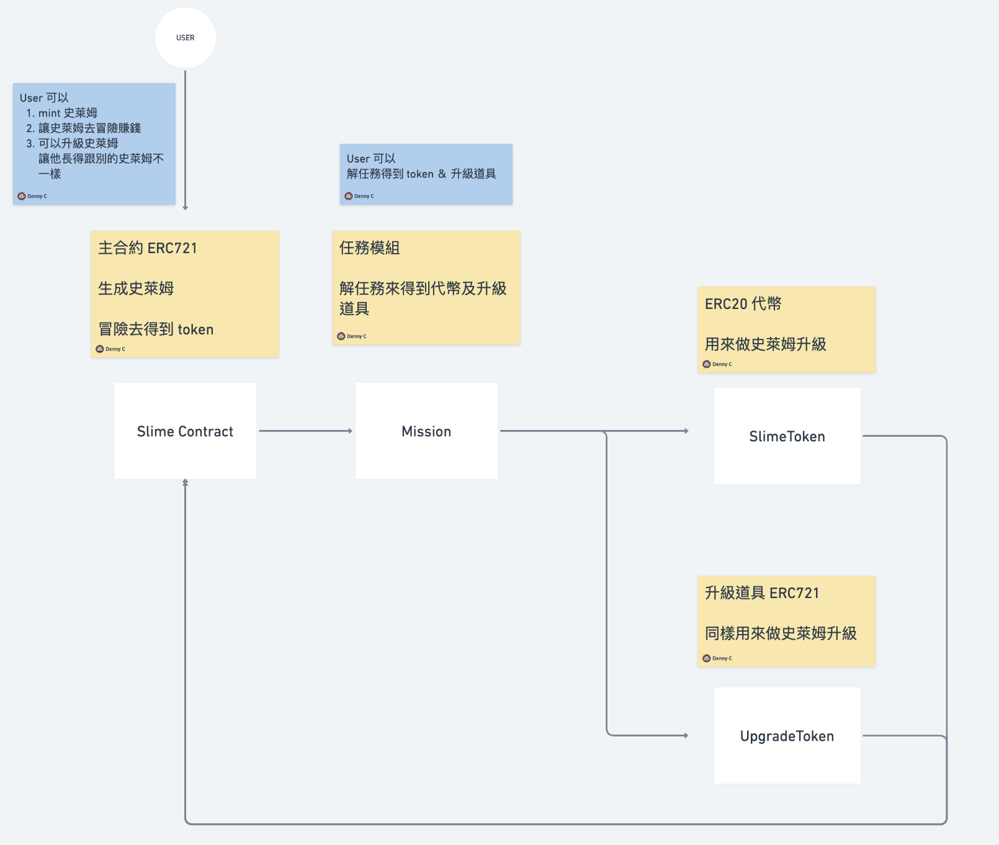

## Blockchain final project

主題： Gamefi  

核心 寵物養成遊戲  

主要相關合約會是： ERC721、ERC20

概念：  
1.最初會有一次的免費生成寵物   
2.在遊戲中提供一些任務：獲得代幣  
3.需使用代幣及道具nft來升級寵物：消耗代幣&道具nft  

---

### flow



---
### Test  

用 foundry 做測試  

```
forge test 
```

#### test coverage  

| File                        | % Lines         | % Statements    | % Branches     | % Funcs         |
|-----------------------------|-----------------|-----------------|----------------|-----------------|
| src/Mission.sol             | 91.67% (11/12)  | 91.67% (11/12)  | 66.67% (8/12)  | 100.00% (4/4)   |
| src/erc20/SlimeToken.sol    | 100.00% (2/2)   | 100.00% (2/2)   | 100.00% (0/0)  | 100.00% (2/2)   |
| src/nft/slime/Slime.sol     | 100.00% (43/43) | 100.00% (53/53) | 90.00% (27/30) | 100.00% (12/12) |
| src/nft/upgrade/Upgrade.sol | 83.33% (10/12)  | 82.35% (14/17)  | 100.00% (0/0)  | 75.00% (6/8)    |
| Total                       | 95.65% (66/69)  | 95.24% (80/84)  | 83.33% (35/42) | 92.31% (24/26)  |

---

